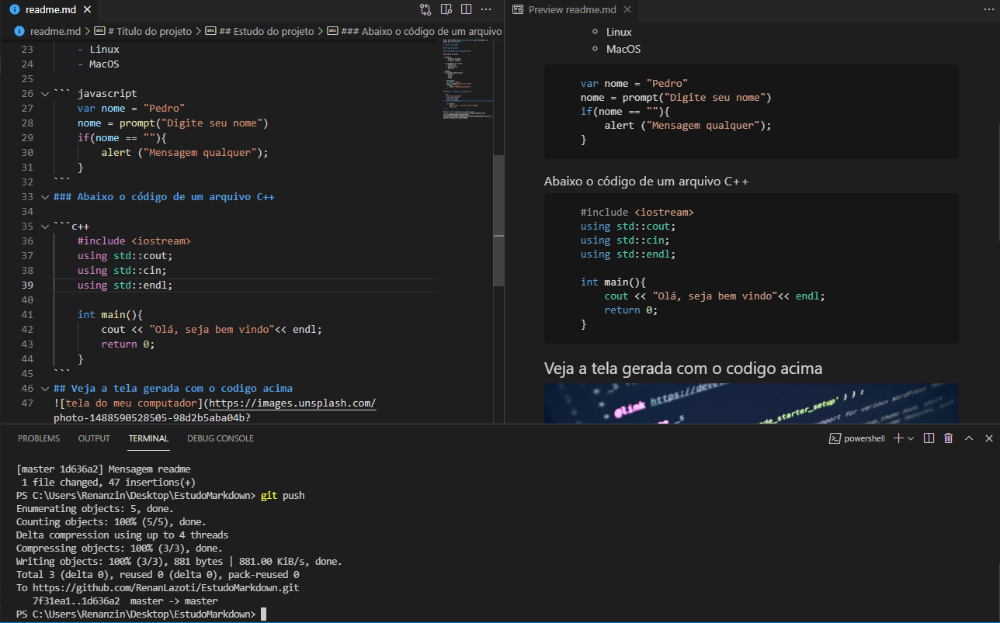

# Nosso projeto com documentação


[](https://github.com/RenanLazoti)

Estou escrevendo minha **documentação** para *estudar* um pouco de ***markdown***

# Titulo do projeto

## Estudo do projeto

### Trabalhando com **documentação**

Nova caixa de texto

* Primeiro  
    * Primeiro.primeiro
    * Primeiro.segundo

1. Linguagens de script
    1. 1. Javascript
    2. 2. Actionscript
    3. 3. VBScript

* Segundo
2. *Sistemas operacionais
    * Windows
    * Linux
    * MacOS

``` javascript
    var nome = "Pedro"
    nome = prompt("Digite seu nome")
    if(nome == ""){
        alert ("Mensagem qualquer");
    }
```
### Abaixo o código de um arquivo C++

```c++
    #include <iostream>
    using std::cout;
    using std::cin;
    using std::endl;

    int main(){
        cout << "Olá, seja bem vindo"<< endl;
        return 0;
    }
```
## Veja a tela gerada com o codigo acima


## Veja o resultado do estudo Markdown


### Tarefas

- [x] Montar o computador
- [x] Formatar o computador
- [x] Preparar o pendrive de boot
- [] Instalar o sistema operacional no computador
- [] Verificar a instalação dos drivers

### Sistemas e empresas

Empresas | sistemas | versão
---------|----------|-------
Microsoft|Windows   | 11
Apple|MacOS|10.14
Ubuntu|Focal|2004
RedHat|Enterprise|8

### Aplicação e dados

jQuery|Python|Node.js|React
------|------|-------|-----
|||
Java|MySql|PostgreSQL|MongoDB
|||
